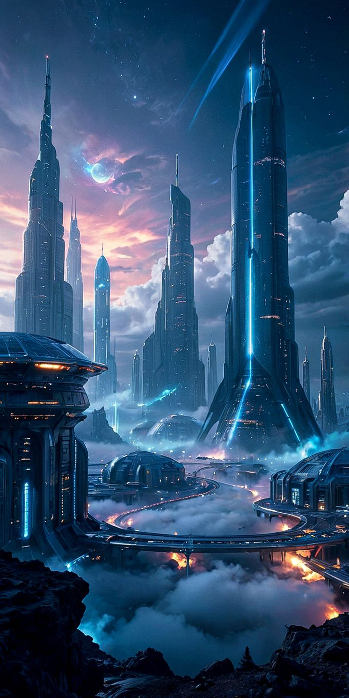

<!--DOCTYPE html-->
<html lang="pt">
<head>
  <meta charset="UTF-8">
  <meta name="viewport" content="width=device-width, initial-scale=1.0">
  <title>Apresentando Telethra</title>
  
</head>
<body>
  <!-- Cabeçalho -->
  <header>
    

      
    

    
☰

  </header>
  <!-- Menu de Navegação -->
  <nav id="menu" class="menu">
    <button class="close-menu" onclick="toggleMenu()">✖</button>
    <ul>
      <li><a href="#">Pág 1</a></li>
      <li><a href="#">Pág 2</a></li>
      <li><a href="#">Pág 3</a></li>
    </ul>
  </nav>
  <!-- Corpo da Página -->
  <main>
    <section class="sect1">
      <h1>Zônflux, Apresenta: Telethra</h1>
      <a href="#">Curio</a>
    </section>
    <section class="sect2">
      <h2>Sobre Telethra</h2>
      
Telethra, um continente de inovação deslumbrante, destaca-se por suas tecnologias incrivelmente avançadas. Ela se encontra integrada a Zenus, um fascinante planeta-ilha que orbita em harmonia dentro de um sistema solar habitado por três mundos distintos.

    </section>
    <section class="sect3">
      

        
Telethra é um continente onde as inteligências artificiais assumem o protagonismo, controlando 90% dos serviços e trabalhos. Em vez de ministérios tradicionais para monitorar água, energia ou economia, cada setor é gerido por uma IA altamente especializada. A segurança pública, englobando funções como polícia e bombeiros, é coordenada por uma única e sofisticada IA, conhecida como O Sentinela.  Enquanto as IAs dominam os serviços que demandam lógica e precisão, como gestão, transporte e análise de dados, deixam para os humanos as profissões que envolvem criatividade, emoção e empatia, como advocacia, música e outras artes. Essa divisão harmoniosa de responsabilidades permite que as pessoas tenham mais liberdade para tomar decisões e mais tempo para aproveitar a vida com suas famílias.  Essa dinâmica não apenas redefine o trabalho e os laços sociais, mas também molda um mundo onde humanos e máquinas coexistem em equilíbrio, cada um desempenhando papéis complementares.

      

      

    </section>
    <section class="sect4">
      

"Uma terra de mistérios"

      

        
Telethra, como um continente futurista e avançado, possui uma estrutura organizacional semelhante à nossa, dividida em múltiplos níveis urbanos para facilitar a administração e o funcionamento social:  Continente: A unidade maior, representando a totalidade de Telethra.  Zonas: Equivalentes aos nossos países, cada uma com sua própria identidade cultural, econômica e tecnológica.  Cidades: Correspondiam aos estados, funcionando como grandes centros administrativos e estratégicos dentro das Zonas.  Municípios: Subdivisões das cidades, atuando como áreas de governança local.  Bairros: Áreas dentro dos municípios, organizadas de forma a facilitar a vida comunitária e os serviços.  Quarteirões: As menores unidades territoriais, representando áreas residenciais ou comerciais compactas e integradas.  Essa hierarquia não é apenas funcional, mas também personalizada para atender às necessidades específicas de Telethra, garantindo uma administração eficiente e uma convivência harmoniosa entre humanos e inteligências artificiais.

      

    </section>
    <section class="sect5">
      
      
Você sabia que a Zônflux não é apenas a base de energia em Telethra, mas também um elemento vivo que reage de forma única às emoções humanas? Alguns dizem que a Zônflux tem uma ligação direta com os segredos mais profundos do universo, podendo até mesmo revelar as origens do tempo e do espaço. Quer saber mais sobre como essa energia molda não apenas os habitantes, mas todo o equilíbrio do cosmos? Então continue conosco nesta jornada!

    </section>
    <section class="sect6">
      
Telethra é um continente futurista de tirar o fôlego, onde o desenvolvimento tecnológico se mistura à singularidade de sua localização. Suspenso no espaço, o céu de Telethra é eternamente noturno, pontilhado por estrelas que parecem sussurrar histórias de um universo infinito.  A inovação está presente até mesmo nos transportes: os automóveis flutuam graciosamente, dispensando rodas. As estradas, projetadas com tecnologia avançada, geram campos magnéticos que interagem com os sistemas dos veículos, criando uma mobilidade suave e silenciosa.  Além disso, os habitantes de Telethra possuem uma conexão única com a energia chamada Zônflux. Alimentados pelo Astroflux, eles têm a habilidade de depositar Zônflux em outras pessoas, criando um elo profundo entre depositador e depositado. Esse vínculo vai além do físico, permitindo que leiam pensamentos e emoções daqueles de outras raças, embora permaneçam incapazes de acessar os segredos das mentes de seus próprios semelhantes.  Esse equilíbrio entre tecnologia, energia e mistério faz de Telethra um lugar único, onde ciência e laços espirituais coexistem em perfeita harmonia.

      <a href="#">Zenus</a>
    </section>
    <section class="sect7">
      
Telethra nasceu como consequência de um evento catastrófico ocorrido em Zenus, que culminou na criação de uma nova forma de Zônflux, conhecida como Astroflux. Esse acidente mudou para sempre o equilíbrio das forças no universo, dando origem a duas espécies distintas.  A primeira delas desenvolveu habilidades extraordinárias, como superforça, velocidade impressionante, resistência sobre-humana e a capacidade de disparar raios laser pelos olhos. A segunda espécie, conhecida como os Telethrans, adquiriu a habilidade única de ler os pensamentos de outras raças, tornando-se mestres da empatia e do entendimento psíquico.  Porém, Telethra ainda não existia como território unificado. Somente após a sangrenta Guerra dos Mundos, que marcou a luta pela sobrevivência e soberania, o continente foi estabelecido como um território independente. Desde então, Telethra passou por eras de reconstrução e inovação, evoluindo para o extraordinário mundo que conhecemos hoje, um símbolo de avanço e equilíbrio entre força, intelecto e conexão espiritual.

      <a href="#">Astroflux</a>
    </section>
    <section class="sect8">
      
      
      
      
    </section>
    <section class="sect9">
      
Telethra, embora seja o continente mais avançado tecnologicamente do universo, enfrenta um grande desafio: a ausência de recursos naturais. No passado, seus antepassados exploraram de forma descontrolada os recursos não renováveis do território, levando ao esgotamento total. Atualmente, para sustentar sua sociedade e economia, Telethra depende da extração legal de recursos dos planetas vizinhos, com os quais mantém acordos diplomáticos e comerciais rigorosos.  Esse histórico motivou os habitantes de Telethra a buscarem alternativas inovadoras, desenvolvendo tecnologias que priorizam a eficiência e o respeito pela natureza. Um exemplo brilhante dessa mentalidade é o WochWork (em português, "Relógio de Trabalho"), um dispositivo multifuncional que integra as funções de telemóvel, computador, TV, cartão de crédito e caderno em um único aparelho compacto e sustentável.  Além disso, os habitantes de Telethra aboliram o uso de papel, em um esforço para proteger as árvores e preservar o equilíbrio ecológico. Essa postura reflete a filosofia do continente: aprender com os erros do passado para construir um futuro harmonioso entre tecnologia, sustentabilidade e respeito ao meio ambiente.

      

    </section>
    <section class="sect10">
      <h3>O que Achaste:</h3>
      
Cada palavra que escrevemos ganha vida através de vocês. Suas vozes, suas emoções e suas interpretações fazem desta história algo maior do que imaginamos. Queremos saber: o que essa jornada desperta em vocês? Compartilhem seus pensamentos, pois é graças a vocês que continuamos a criar.

      

      <form id="formulario">
        <input type="text" id="nome" placeholder="Nome">
        <input type="email" id="email" placeholder="E-mail">
        

          <input type="date" id="data">
          <input type="tel" id="contato" placeholder="Contato">
        

        <textarea id="mensagem" placeholder="Comentário ou Mensagem"></textarea>
        <button type="submit">Enviar</button>
      </form>
    </section>
  </main>
  <!-- Rodapé -->
  <footer>
    
A você, visitante, nosso mais sincero agradecimento por embarcar nesta jornada fascinante sobre o Espectro. Sua curiosidade e dedicação nos motivam a continuar explorando os mistérios deste universo tão único. Esperamos que cada secção lida tenha despertado sua imaginação e lhe oferecido momentos de reflexão e inspiração.

    <a href="#">Bóris</a>
    
© 2025 Universo Zônflux. Todos os direitos reservados.

  </footer>
    
</body>
</html>
